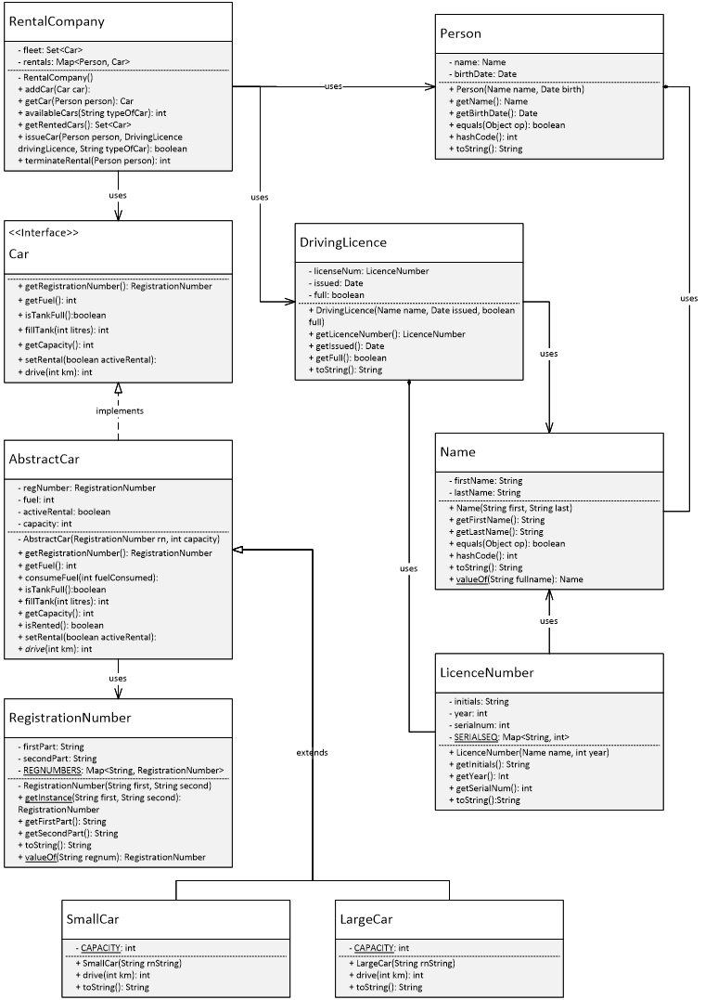

# Car Rental application for Advanced Java Assignment

## Classes

It was decided that Name, Person, RegistrationNumber and DrivingLicence were obvious classes; composed of various parts, that need to be accessed individually by methods, and likely to be used by other entities in the system e.g. Person itself uses Name.

It was also decided to create a separate class for LicenceNumber, as it was considered to have enough non-trivial functionality to justify implementing this separately to the DrivingLicence class.

A RentalCompany class is also provided to support the functionality of the Rental Company itself – the fleet and rental associations between Car and Person and the related rental functionality must be located somewhere above any instance of each of those classes.

Clearly some representation of Cars is needed.  The next section discusses this in more detail.

## Car hierarchy

There are two types of car in the rental company&#39;s fleet – small and large.  Both have common properties and methods, but differ in their tank capacity and the behaviour of their _drive_ methods.  A single Car class with an internal immutable state representing the type of car could be used where that state determined the capacity and behaviour of drive, but implementation may prove fragile if another type of car is introduced.  Small and large cars may also inherit from a standard Car superclass, however this object could be instantiated and does not represent any real world car.  It has no known capacity or _drive_ behaviour.  Therefore SmallCar and LargeCar have been designed to extend the _abstract_ class AbstractCar, which contains all the common properties and methods.

There is however a requirement to represent cars generically, specifically in the RentalCompany.getRentedCars method which returns a single set of all currently rented cars, both small and large.  A Car _interface_ has therefore been introduced for this purpose.  This also simplifies the implementation of the _fleet_ and _rentals_ properties, otherwise separate _fleetSmallCars_ and _fleetLargeCars_ structures (and similar for rentals) would be required.  Again, this code would be fragile if a new car type was added.

## JUnit test classes

There is a separate JUnit test class for each of the classes in the solution, except for the Car hierarchy.  A single JUnit test class is used to test both SmallCar and LargeCar, due to the need to test the constraint on the uniqueness of registration numbers against both types of car.

## UML diagram

## Class designs

`RentalCompany`

The RentalCompany class represents the Car Rental company described in the requirements.  It comprises the fleet of cars and a collection of rentals (associations between Car and Person).

| Design Principle | Decisions |
| ---------------- | --------- |
| Mutability | This is a _mutable_ class – the RentalCompany&#39;s fleet changes as cars are added and the rentals change as cars are issued and rentals are terminated. |
| Object methods overridden? | Object.equals is NOT overridden.  There is no logical specification of equality in the requirements which assume only one instance of RentalCompany.  Given two instances then there is no sensible concept of equality based on the components of RentalCompany – two instances may have a fleet of identical size but the instances of the cars in each fleet must be different.  Therefore identity is sufficient i.e. if two instances of RentalCompany are equal, then they must be the _same_ instance. There is also therefore no need to override Object.hashCode. |
| Factory method? | RentalCompany could have used a Factory method instead of a public constructor to guarantee it as a singleton class as the requirements only mention one company.  However this limitation has not been requested and without it the solution may be extended e.g. to represent some kind of Franchising operation that manages several rental companies. |
| Defensive Programming | All methods taking parameters of Object types Person, DrivingLicence and String check for null values.  Those values taking the String parameter typeOfCar specifying SmallCar or LargeCar check that one of those values is passed. |

The fleet is designed as a Set implemented as a HashSet of Car objects.  All Car objects in the fleet are unique, determined by object identity (i.e. if two Car objects are equal then they must be the same object).  Cars are not required to be stored or retrieved in any particular order. Rentals are designed as a Map implemented as a HashMap from the key object, Person (as it is immutable) to the value object, Car.  This enables quick determination of whether or not any particular Car or Person objects exist in the rentals Map using standard methods, and also retrieval of a particular Car for a specified Person.  One public method was added in addition to those required.  The addCar method adds a Car to the fleet.  The Constructor starts with an empty fleet and the 20 small cars and 10 large cars in the specification are added using addCar.  The rental company may therefore grow by adding extra cars to the fleet without redesigning the code.  |

`Name`

A Name consists of a first name and a last name of a person.

| Design Principle | Decisions |
| ---------------- | --------- |
| Mutability | Name is immutable.
- It has no mutator methods
- It is final and can&#39;t be extended
- All fields (firstName and lastName) are private and final
Defensive copying of the fields going in (the Constructor) and coming out (the get methods) is unnecessary as they are all of type String, which is immutable.  |
| Object methods overridden? | Object.equals is overridden with a sensible logical equality specification for Name i.e. two Name objects are equal if they have the same firstName and lastName. Object.hashCode is overridden because Object.equals was overridden and therefore it is necessary to ensure that the hashcodes of two objects are equal when the objects are equal. Object.toString is overridden to provide a more useful, readable view of all the information about a Name i.e. the first name and last name.  The format is [Firstname LastName]. valueOf has been implemented to provide a means to convert a full name expressed as a String into a Name object.  |
| Factory method? | There are no constraints on creating Name objects that suggest the use of a Factory method in preference to a standard Constructor.  |
| Defensive Programming | The constructor validates the first and last name parameters to ensure that they are not null, and also that they match a sensible name format i.e. an uppercase letter, followed by zero or more lowercase letters.  |

| Person  |
| --- |
| A Person, representing a customer, consists of a name and date of birth of a person.  |
| Mutability | Person is immutable.
- It has no mutator methods
- It is final and can&#39;t be extended
- All fields (name and birthDate) are private and final
- Defensive copies are made of birthDate going in (the Constructor) and coming out (the getBirthDate method) as Date is a mutable object.  This is not necessary for name as String is immutable.
  |
| Object methods overridden? | Object.equals is overridden as identity does not satisfy the logical equality requirement given for Person i.e. two Person objects are equal if they have the same name and birthDate. Object.hashCode is overridden because Object.equals was overridden and therefore it is necessary to ensure that the hashcodes of two objects are equal when the objects are equal. Object.toString is overridden to provide a more useful, readable view of all the information about a Person i.e. the name and date the birth.  The format is [Firstname LastName],[dd/MM/yyyy]  |
| Factory method? | There are no constraints on creating Person objects that suggest the use of a Factory method in preference to a standard Constructor.  |
| Defensive Programming | The Constructor validates the name and date of birth to ensure that they are not null.  It is assumed that if name is not null, it is valid as it will have been validated by the Name constructor and is immutable.  The date of birth is further validated to ensure that it is not in the future.  |

| LicenceNumber  |
| --- |
| A LicenceNumber is composed of three parts:
- Initials of a driver
- Year of issue
- Serial number to ensure licence numbers with the same initials and year are unique
It was considered that LicenceNumber had enough non-trivial requirements to merit its own class.  |
| Mutability | LicenceNumber is immutable.
- It has no mutator methods
- It is final and can&#39;t be extended
- All fields (initials, year, serialNum) are private and final
- Defensive copying of the fields going in (the Constructor) and coming out (the get methods) is unnecessary as they are all of type String or int, which are immutable.
  |
| Object methods overridden? | Object.equals is NOT overridden.  Because instances of LicenceNumber are ensured to be unique by the serial number, then two licence numbers can only be equal if they are in fact the same instance – therefore identity (the default behaviour of Object.equals) is sufficient.  There is also therefore no need to override Object.hashCode. Object.toString is overridden to provide a more useful, readable view of all the information in a LicenceNumber i.e. all three components.  The format is [initials]-[year]-[serialnum]. valueOf cannot be implemented to take the output of LicenceNumber.toString to convert it into a valid LicenceNumber.  This would either invalidate the uniqueness of the serial number, or require the substitution of a serial number not in the given string.  |
| Factory method? | A Factory method is not needed to implement the uniqueness constraint.  Given a name (from which to derive the initials) and a year of issue, a standard Constructor generates a serial number to ensure uniqueness.  |
| Defensive Programming | The Constructor validates the name to ensure that it is not null.  It is assumed that if name is not null, it is valid as it will have been validated by the Name constructor and is immutable.  The year of issue is validated to ensure that it is not in the future.  |

| DrivingLicence  |
| --- |
| A DrivingLicence consists of a LicenceNumber, a date of issue and an indication of whether the licence is a full driving licence or not.  |
| Mutability | Person is immutable.
- It has no mutator methods
- It is final and can&#39;t be extended
- All fields (licenceNum, issued and full) are private and final
- Defensive copies are made of issued going in (the Constructor) and coming out (the issued method) as Date is a mutable object.  This is not necessary for licenceNum and full as LicenceNumber and boolean are immutable.
Note: in this implementation, the status of a licence i.e. whether full or not cannot be changed.  A full licence and e.g. a provisional licence would therefore be different licence instances.  |
| Object methods overridden? | Object.equals is NOT overridden.  DrivingLicence includes a LicenceNumber using Composition, and creating a new LicenceNumber ensures its uniqueness.  Therefore DrivingLicence is also unique, and therefore identity is sufficient for equality.  There is also therefore no need to override Object.hashCode.  |
| Factory method? | A Factory method is not needed.  There is an implied constraint in the requirements that LicenceNumber must be unique across all DrivingLicence instances.  This is met by generating the LicenceNumber by creating a new one within the DrivingLicence constructor.  |
| Defensive Programming | The Constructor validates the name and date of issue to ensure that they are not null.  It is assumed that if name is not null, it is valid as it will have been validated by the Name constructor and is immutable.  The date of birth is further validated to ensure that it is not in the future.  |

| RegistrationNumber  |
| --- |
| A RegistrationNumber is composed of two parts:
- First part – two letters followed by two digits
- Second part – three letters
-
 |
| Mutability | RegistrationNumber is immutable.
- It has no mutator methods
- It is final and can&#39;t be extended
- All fields (firstPart and secondPart) are private and final
- Defensive copying of the fields going in (the private Constructor and Factory methods) and coming out (the get methods) is unnecessary as they are all of type String, which is immutable.
  |
| Object methods overridden? | Object.equals is NOT overridden.  RegistrationNumber is ensured to be unique by its Factory method.  Therefore identity is sufficient for equality.  There is also therefore no need to override Object.hashCode. Object.toString is overridden to provide a more useful, readable view of all the information about a RegistrationNumber i.e. the first and second parts.  The format is [FirstPart SecondPart]. valueOf has been implemented to provide a means to convert a whole registration number expressed as a String into a RegistrationNumber object.  |
| Factory method? | A Factory method prevents a duplicate RegistrationNumber from being created. |
| Defensive Programming | The Factory method validates the first and second part parameters to ensure that they are not null, and also that they match the required formats i.e. two letters followed by two digits for the first part, and three letters for the second part.  |

| AbstractCar  |
| --- |
| This class provides a partial implementation of the Car interface i.e. those elements common to both SmallCar and LargeCar.  |
| Mutability | This is a _mutable_ class – the internal state of the AbstractCar, specifically the fuel and activeRental fields, must be changeable.  They are private but cannot be final.Furthermore the class cannot be final as it is extended by the subclasses SmallCar and LargeCar.The remaining fields regNumber and capacity are private and final, and all of the input and output fields are immutable types (therefore defensive copying is not required), so mutability has been minimised.  |
| Object methods overridden? | None of the Object methods have been overridden in the abstract class AbstractCar. |
| Factory method? | A Factory method is not needed, there are no constraints that would require one. |
| Defensive Programming | The Constructor receives a RegistrationNumber object parameter rn, but it is only called from one of the subclass Constructors which guarantee that rn is valid and not null.  |

| SmallCar  |
| --- |
| This subclass of AbstractCar implements elements of the Car interface specific to small cars.  |
| Mutability | SmallCar inherits the mutable fuel and activeRental fields from AbstractCar and is therefore mutable.  It is itself a final class which can&#39;t be further subclassed, and introduces one new variable CAPACITY which is a private final immutable constant.  Its methods receive and return parameters of type String and integer which are immutable types.  |
| Object methods overridden? | Object.equals is NOT overridden.  If two SmallCar objects are equal then they must be the same object, as it is not possible for two separate SmallCar instances to have the same RegistrationNumber.  So identity (the default behaviour of Object.equals) is sufficient.  There is also therefore no need to override Object.hashCode. Object.toString is overridden to provide a more useful, readable view of all the information in a SmallCar.  The format is &quot;SmallCar&quot;,[registration number],[fuel].  |
| Factory method? | A Factory method is not needed, there are no constraints that would require one. |
| Defensive Programming | The drive method checks the km parameter to ensure that it is not negative (cannot drive a negative distance).  |

| LargeCar  |
| --- |
| This subclass of AbstractCar implements elements of the Car interface specific to large cars.  |
| Mutability | LargeCar inherits the mutable fuel and activeRental fields from AbstractCar and is therefore mutable.  It is itself a final class which can&#39;t be further subclassed, and introduces one new variable CAPACITY which is a private final immutable constant.  Its methods receive and return parameters of type String and integer which are immutable types.  |
| Object methods overridden? | Object.equals is NOT overridden.  If two LargeCar objects are equal then they must be the same object, as it is not possible for two separate LargeCar instances to have the same RegistrationNumber.  So identity (the default behaviour of Object.equals) is sufficient.  There is also therefore no need to override Object.hashCode. Object.toString is overridden to provide a more useful, readable view of all the information in a LargeCar.  The format is &quot;LargeCar&quot;,[registration number],[fuel].  |
| Factory method? | A Factory method is not needed, there are no constraints that would require one. |
| Defensive Programming | The drive method checks the km parameter to ensure that it is not negative (cannot drive a negative distance).  |
